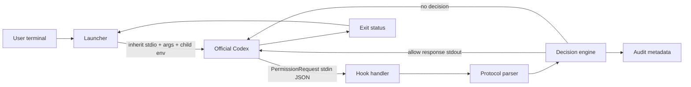
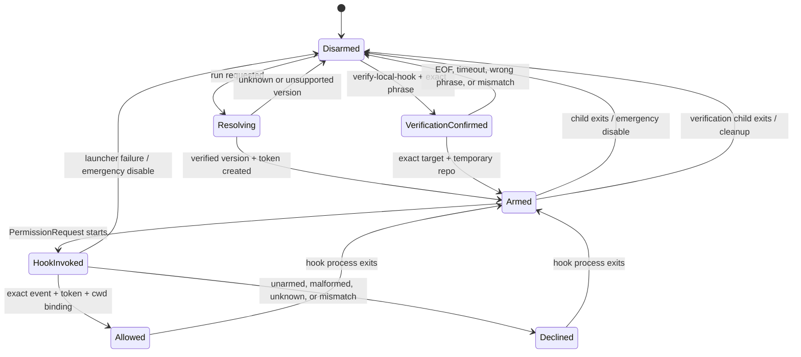

# Proposed hook-based architecture

This document describes the authoritative implementation direction. The former PTY/screen-scraping design is retained only as historical proof-of-concept context and is not a production architecture.

## Context and goals

The launcher should preserve ordinary Codex by executing the user's existing official CLI as a normal child process. Codex remains responsible for its TUI, authentication, configuration, sessions, model selection, sandbox, plugins, and exit behavior. Automatic approval is a narrow, explicit `PermissionRequest` hook response, not terminal input automation.

The authoritative MVP path is hook-based. The old PTY/screen-scraping experiment is not a fallback or planned primary implementation. `run` and `print-hook-config` use a typed exact compatibility registry. `verify-local-hook` remains an experimental, one-session-only mechanism for the exact local target Codex 0.151.0; its reviewed evidence is recorded in that registry but the mechanism does not promote entries automatically.

The current repository is pre-alpha. The only verified production tuple is Linux, local CLI launcher, Codex CLI 0.151.0, `PermissionRequest`, `permission-request-v1`, observed `Bash`, and one-request structured allow. No live hook configuration is installed. The second isolated live verification met the clean-repository and cleanup gates; its concise non-sensitive evidence is recorded in `src/compatibility.rs` and `docs/compatibility.md`.

## Components

- **CLI parser:** separates launcher subcommands and the `--`-delimited Codex argument vector.
- **Official Codex resolver:** resolves `codex`, canonicalizes it for recursive self-resolution checks, and queries `--version`.
- **Compatibility registry:** matches exact Codex version, OS, local CLI surface, hook protocol, and reviewed release metadata.
- **Session arming mechanism:** creates a cryptographically random token, exact Codex metadata, and expected cwd for the child process only.
- **Local verification gate:** requires Linux, exact target-version equality, an interactive exact confirmation phrase, a temporary Git repository, and a child-only hook override.
- **Child-process launcher:** starts Codex with inherited stdin, stdout, stderr, environment, working directory, and user arguments.
- **PermissionRequest hook handler:** reads one bounded request and produces a protocol response or no decision.
- **Hook protocol parser:** validates JSON shape, event name, required fields, bindings, and supported internal protocol marker.
- **Decision engine:** combines event, arming, cwd/session binding, version compatibility, and fail-closed policy.
- **Fail-closed response path:** writes only the exact structured allow object on success; all other paths write no decision.
- **Compatibility detector:** identifies the installed Codex version and consults the explicit verified allowlist.
- **Audit recorder:** emits redacted metadata/hashes without complete commands, tool input, credentials, or tokens.
- **Verification audit recorder:** records whether a single allow response was produced using only short hashes and temporary state; it does not claim that a hook event proves command success.
- **Configuration installer (later milestone):** may install or remove a reviewed hook while preserving unrelated Codex configuration; it is not implemented here.
- **Shutdown and exit propagation:** waits for the child, handles ordinary interruption, and maps the child's exit status to the launcher.

The default design intentionally does not allocate a second PTY. A normal child process inherits the terminal and avoids duplicating terminal emulation, raw-mode restoration, screen parsing, cursor tracking, and option-number assumptions.

## Interfaces

Conceptual interfaces are (the names are design seams, not current public Rust APIs):

```text
trait ApprovalSource {
    fn read_request(&mut self) -> Result<ApprovalEvent, ProtocolError>;
}

trait ApprovalResponder {
    fn allow_one_request(&mut self) -> Result<AllowResponse, ResponseError>;
}

struct ApprovalEvent {
    event_name: String,
    session_id: String,
    cwd: String,
    tool_name: String,
    tool_input: JsonValue,
}

enum DetectionResult {
    NoMatch,
    Approval(ApprovalEvent),
    Ambiguous(String),
    UnsupportedVersion(String),
}
```

The responder has no permanent-rule or session-wide operation. `ApprovalSource` treats stdin as hostile data, and the decision engine is the only component allowed to select `allow` for one current request. `DetectionResult::NoMatch` represents a normal non-approval event; ambiguity and unsupported versions always route to no decision.

## Component and request-flow diagram



Request flow:

1. The user starts `run` and explicitly chooses to use this launcher, or starts the separate `verify-local-hook` experiment.
2. The resolver finds the official executable and reads its version.
3. The compatibility detector enables automatic hook registration only for the exact verified registry tuple. Unknown versions and unsupported surfaces remain unarmed. The verifier has a separate exact 0.151.0 target gate and never edits the registry automatically.
4. The launcher creates a unique token, sets child-only version/surface/protocol/cwd arming variables, and starts Codex with inherited terminal I/O. The verifier additionally sets the exact test-action guard and a temporary audit path.
5. Codex synchronously starts the configured `PermissionRequest` hook before surfacing its normal prompt.
6. The hook parses the request, verifies event identity and bindings, and returns the one-request allow object only when armed.
7. Codex applies its normal hook composition and permission semantics; the launcher does not execute the requested command.
8. The child exits, the launcher records minimal metadata, and propagates the exit result.

## Armed/disarmed state machine



`Allowed` is one request only. It does not transition to a permanently authorized state. Multiple Codex requests may produce multiple independent hook invocations while the child remains armed, and each has the same consequential warning.

## Concurrency design

Codex may invoke matching command hooks concurrently, and multiple hook sources may participate. The hook handler must be reentrant and must not use a process-global mutable approval flag. Each launcher invocation receives a distinct random token; each hook invocation validates that token and its cwd binding independently.

The MVP does not coordinate a shared request queue or attempt to deduplicate semantically similar requests. It authorizes at most the current hook invocation. The verification path requires exactly one recorded allow before it can report a candidate result; any other count prevents promotion. A later design may add a per-session broker with explicit request identifiers, but it must preserve one-request scope and deny on ambiguity. Descendant environment inheritance is a known concurrency/process-identity limitation.

The observed `Bash` constraint is part of the compatibility tuple: other tool types receive no decision until independently verified.

Stronger Linux binding is intentionally unresolved in this milestone. The concrete candidate is a per-session 0700 directory under `$XDG_RUNTIME_DIR` containing the expected Codex PID and `/proc/<pid>/stat` start time, with the hook checking that its parent ancestry reaches that exact process without PID reuse. Spawn races, hook grandchildren, namespace differences, and cleanup-on-crash must be proven fail-closed before implementation. No cross-platform guarantee is inferred from this Linux design.

## Proposed Rust module layout

```text
src/
  main.rs
  cli.rs
  codex.rs
  launcher.rs
  arming.rs
  hook.rs
  protocol.rs
  decision.rs
  audit.rs
  compatibility.rs
  error.rs
tests/
  hook_mvp.rs
```

The listed modules are implementation seams, not evidence that every future property is complete. Configuration installation should be a later module or separate command with its own review.

## Linux-first plan

Linux is the verified first target because the evidence is Ubuntu-based and ordinary inherited terminal I/O is straightforward to validate there. The verified path covers process resolution, `-c` hook registration, child environment behavior, request parsing, response handling, interruption, exit status, argument forwarding, and temporary test configuration without writing the user's live Codex home.

Future registry entries must first demonstrate one harmless, authenticated `PermissionRequest` invocation using a temporary or otherwise isolated configuration. Until independently reviewed, each new tuple remains unverified and `run` launches it with automation disabled.

## Unsupported platforms and future IDE integration

macOS and Windows require independent validation of executable resolution, inherited terminal behavior, environment inheritance, interruption, signing, packaging, process creation, console/pseudoconsole behavior, quoting, environment scope, exit codes, and configuration paths. Neither platform inherits Linux hook or launcher support claims. VS Code/IDE, desktop, remote, container, WSL, SSH-hosted IDE, and Codex cloud surfaces are also unsupported and unverified.

IDE-extension integration is planned separately. It needs a persistent-hook composition design and secure arming/process binding that can distinguish the intended IDE session; the current child-local CLI design and evidence cannot be reused as that guarantee.

## Testing architecture

Tests should include:

- protocol fixtures for valid armed PermissionRequest, unarmed request, wrong event, missing fields, malformed JSON, empty input, oversized input, unknown fields, and stdout purity;
- arming tests for random distinct tokens, missing/incorrect tokens, cwd mismatch, cleanup, token non-disclosure, and concurrent sessions;
- a fake Codex executable for exact argument forwarding, environment propagation, exit status, missing executable, PATH resolution, and recursion protection;
- compatibility tests for verified versions, unknown/malformed versions, and the fact that legacy option-1 evidence does not establish hook support;
- PTY-free process integration tests for inherited stdin/stdout/stderr where testable and normal interruption;
- verification lifecycle tests for exact version binding, confirmation aborts, temporary repository cleanup, child-local overrides, action restriction, audit redaction, and non-promotion;
- fuzz/property tests for JSON limits, unknown fields, and decision-state transitions; and
- real opt-in Codex integration tests only after a supported version is locally demonstrated, never with unattended destructive commands.

Positive fixtures alone are insufficient. Tests must assert that malformed, ambiguous, unarmed, unsupported, or mismatched requests receive no allow response.

## Why screen parsing was abandoned

The legacy Expect proof showed that option 1 could select one approval in one Ubuntu/Codex 0.151.0 scenario. It did not establish stable numeric ordering, terminal wording, ANSI behavior, or semantic association with the requested command. Screen scraping also introduces redraw races, terminal-control injection, cursor/width/locale differences, and raw-mode recovery obligations. The documented `PermissionRequest` hook supplies a structured event and response path before the prompt, so it is the authoritative primary implementation.

## Packaging and future App Server backend

Packaging is a later milestone. It must not replace Codex, silently edit configuration, or install a hook without explicit review, and it must authenticate artifacts and provide removal/recovery guidance.

The first verifier deliberately does not install anything: it relies on the existing official authentication context, runs in a temporary repository, and supplies the hook through `-c` for that child. A future installer must be a separate reviewed component.

A future direct Codex App Server backend may provide an even more structured approval transport. It would still require protocol negotiation, request-scope validation, authentication review, and fail-closed behavior. The hook backend should remain separate from that future transport while sharing decision and audit policy.

## Open questions

- Which future Codex releases and hook protocol versions can be demonstrated safely and admitted independently?
- Does each newly supported Codex version reliably inherit arbitrary child environment variables into synchronous hooks?
- How can the hook bind an invocation to the exact Codex parent/session without trusting a bearer-like environment token?
- What is the exact `-c` merge behavior when user, project, plugin, managed, and child-only hook sources coexist?
- How should `print-hook-config` and a future installer preserve unrelated hooks and trust-review state?
- What platform-specific process and signal behavior must be documented before macOS or Windows support?
